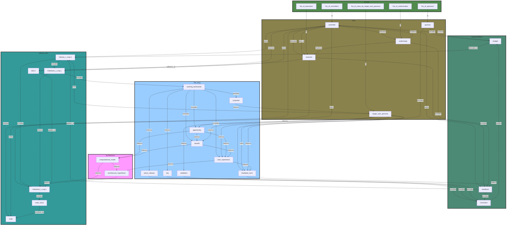

# Team Structure for the project

## Sponsors/Stakeholders:
- Responsible for giving structured feedback when the team asks for it
- Provides `budget` for the project

### People:
`list_of_stakeholders`

## Target User Personas:
- Responsible for using a deployed major version release in line with the expected user experience
- Responsible for using the in-app feedback loop to influence the roadmap for subsequent releases

### People:
`list_of_users_by_target_user_persona`

## Controller:
- Responsible for:
  - Stakeholder management
  - Release Planning
  - Milestone Planning
  - Code Review
  - Enforcement of the right level of SDLC
  - Team Staffing
  - Budget control and alerting

### People:
`list_of_controllers`

## Executor:
- Responsible for:
  - Issue Planning
  - Giving feedback on Release/Milestone planning when required
  - Code Implementation for Issues
  - Adhering to SDLC as per the needs of the project
  - Code Review for other Executors

### People:
`list_of_executors`

## Understudy:
- Responsible for:
  - Shadow everything that is going on
  - Proactively ask questions if they don't understand what is going on
  - Learn the workflows of the Executor and the Controller so that they can provide support in case execution is at risk

### People:
`list_of_understudies`

## Team Graph

